# DevOps Git Workflow - Uvexzon

## Why GitFlow?
- **Pros**: 
  - Clear separation of work (features, hotfixes, releases)
  - Stable main branch for production
  - Safe for large teams
- **Cons**:
  - Can feel heavy for small projects
  - Slower compared to trunk-based development

## Branching Strategy
- `main`: Production-ready code
- `develop`: Integration branch
- `feature/*`: New features
- `bugfix/*`: Bug fixes
- `hotfix/*`: Urgent production fixes
<<<<<<< HEAD

=======
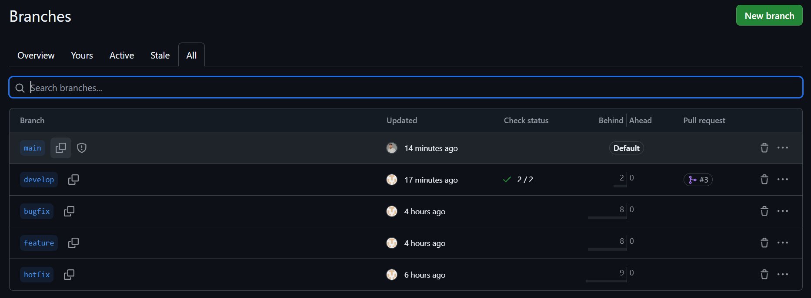
>>>>>>> a4a894c206bec2111f7f1b5ada344bd265e0e772

## Pull Request (PR) Reviews
1. Developer creates PR → merge into `develop` or `main`.
2. Reviewer checks code, tests results, gives approval.
3. Merge allowed only after approval.

## Roles
- **Developer**: Works on `feature/*` or `bugfix/*` branches.
- **Reviewer**: Reviews and approves PRs.
- **Release Manager**: Creates releases, tags, and merges into `main`.

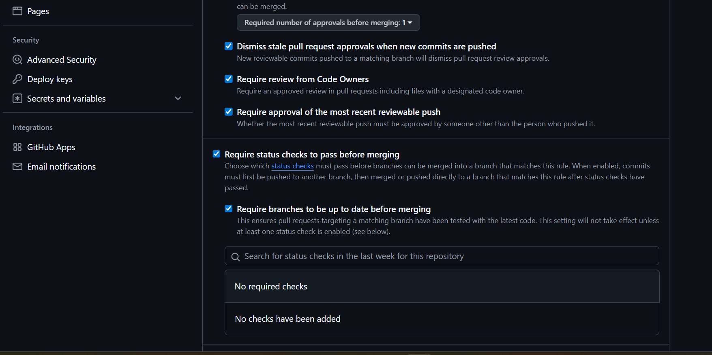
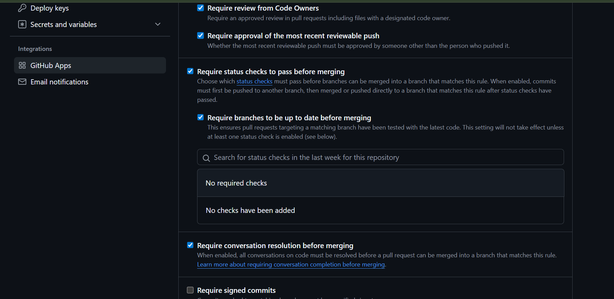

## Release Process
- Run `./release.sh vX.Y.Z` to create a new release.
- Script generates a changelog and pushes tag.

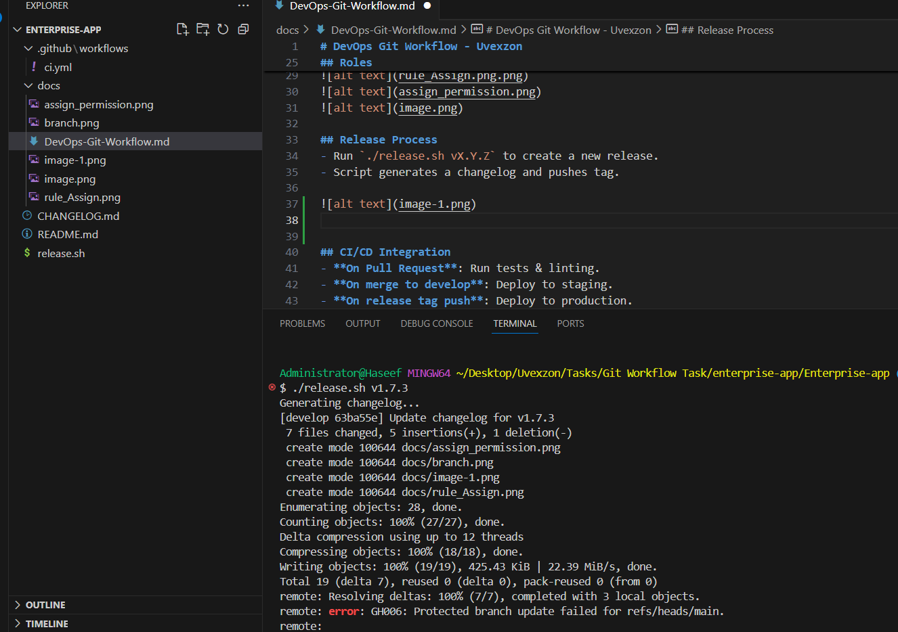
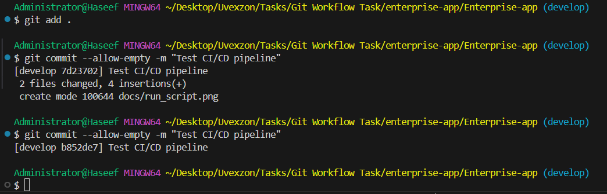

## Push the Code spefic Branch. 
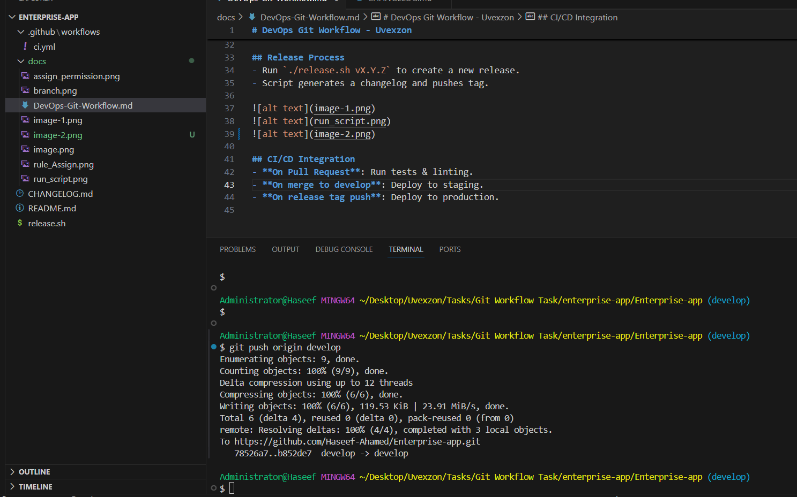
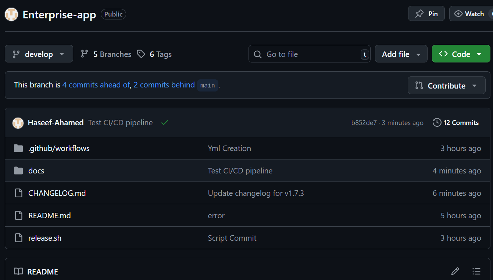

## Assign the pull request 
- **Assign the merge the source code from devevlop to main branch.**
- **then add the title to identify the reviwer, why the request reaised for approval**
- **Select the who is the review the code and documentation**
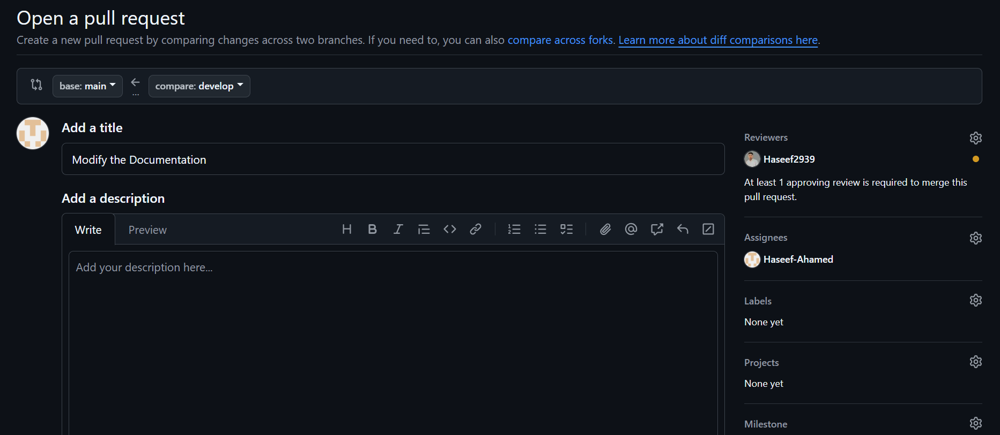

## How to Approval this Pull request from reviewer site
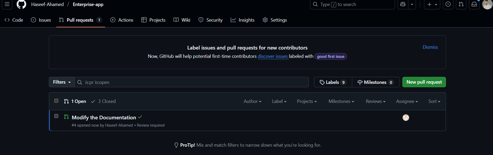

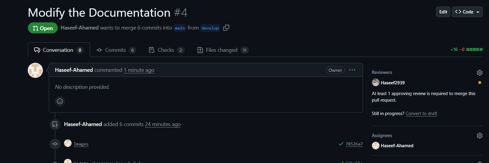

**Check the Files and give the review**

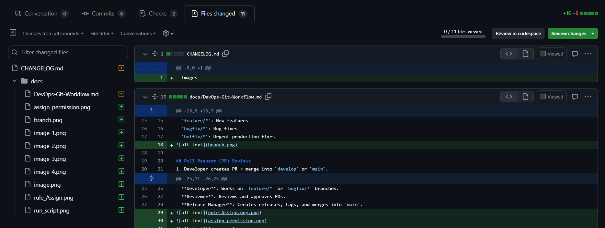

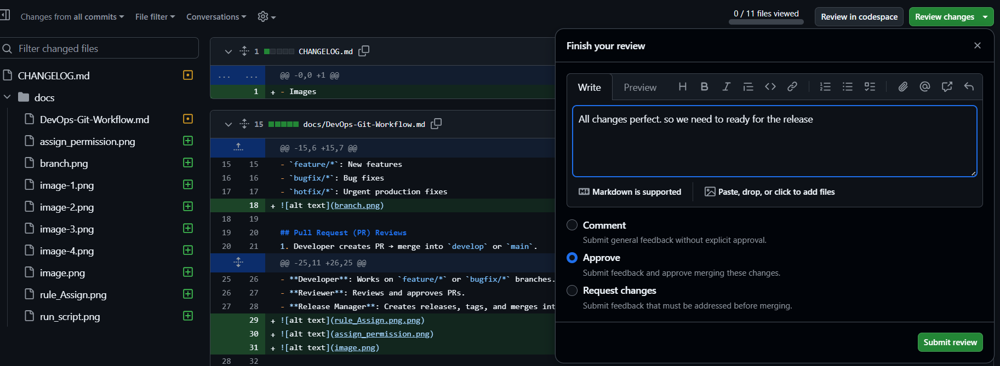

**Approved by reviewer so we can merge the all document**
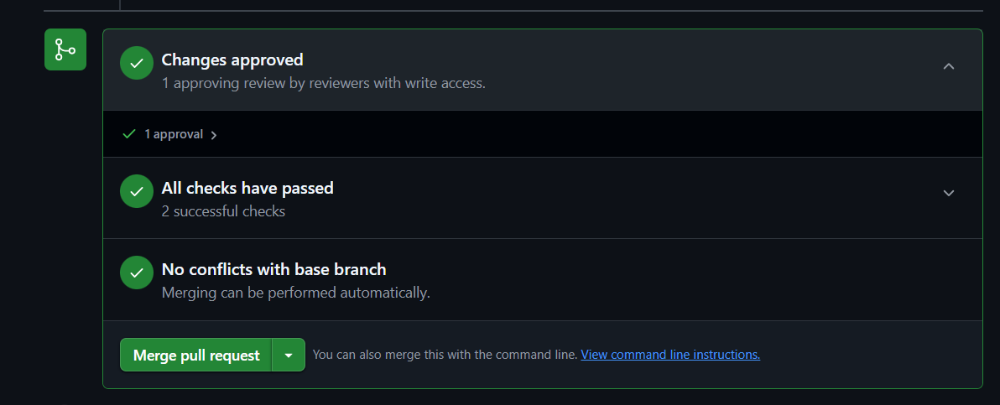

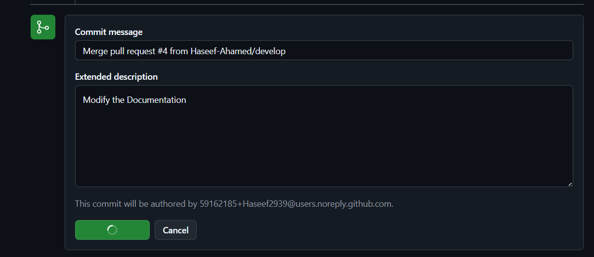

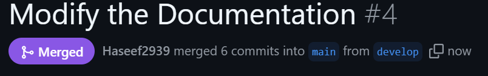

**Verify the Merge is perfectly worked**
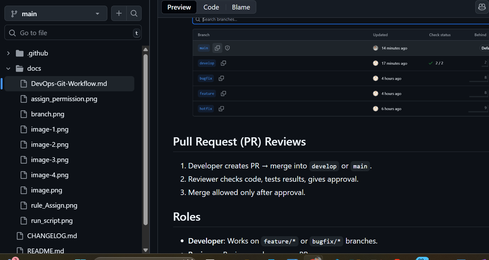

## CI/CD Integration
- **On Pull Request**: Run tests & linting.
- **On merge to develop**: Deploy to staging.
- **On release tag push**: Deploy to production.

<<<<<<< HEAD

[def]: image.png
=======
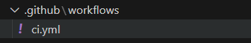

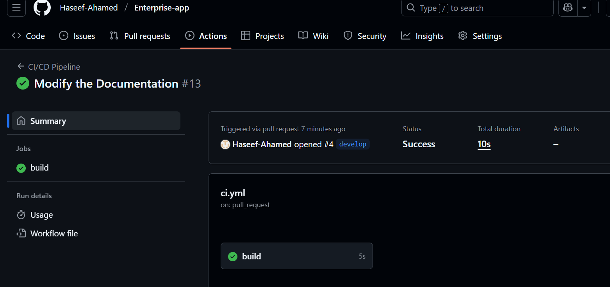

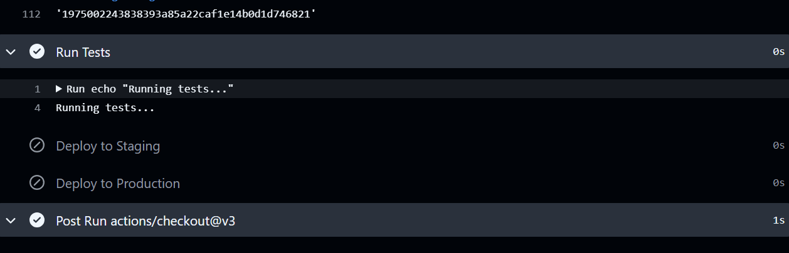

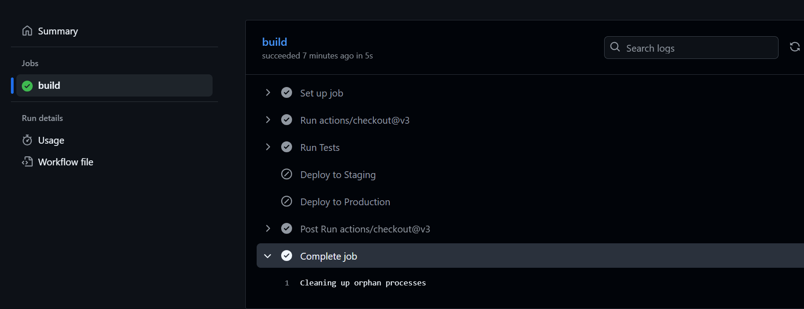

HI Good Evening... Everyone

>>>>>>> a4a894c206bec2111f7f1b5ada344bd265e0e772
